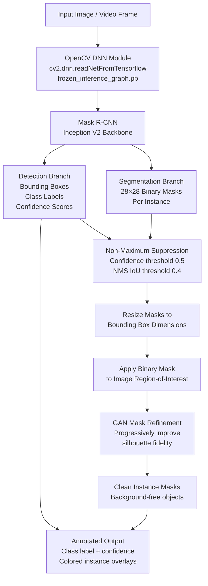

# Image Instance Segmentation

<div align="center">

[](https://www.python.org/)
[](https://opencv.org/)
[](LICENSE)
[](https://github.com/ashish-code/Image-Instance-Segmentation/stargazers)
[]()
[]()

**Multi-object instance segmentation and classification using Mask R-CNN (Inception V2 backbone) with GAN-based mask refinement for precise object silhouette extraction.**

</div>

---

## 🔍 Overview

Standard semantic segmentation assigns a class label to each pixel, but cannot distinguish between separate instances of the same class. **Instance segmentation** provides both class labels *and* unique instance masks for every object in a scene — critical for robotics, autonomous driving, medical image analysis, and augmented reality.

This project implements a full instance segmentation pipeline:
1. **Detection + segmentation**: Mask R-CNN with Inception V2 backbone, pre-trained on MS-COCO 80 classes
2. **Mask refinement**: GAN-based approach to progressively improve mask fidelity and eliminate background clutter
3. **Inference via OpenCV DNN**: No TensorFlow runtime dependency for deployment — uses the frozen inference graph via `cv2.dnn`

---

## 🏗️ Pipeline Architecture



---

## 📊 Supported Classes (MS-COCO 80)

The model detects and segments 80 object categories including:

`person` `bicycle` `car` `motorcycle` `airplane` `bus` `train` `truck` `boat` `traffic light` `fire hydrant` `stop sign` `bench` `bird` `cat` `dog` `horse` `sheep` `cow` `elephant` `bear` `zebra` `giraffe` `backpack` `umbrella` `handbag` `tie` `suitcase` `sports ball` `bottle` `wine glass` `cup` `fork` `knife` `spoon` `bowl` `banana` `apple` `sandwich` `pizza` `donut` `cake` `chair` `couch` `potted plant` `bed` `dining table` `toilet` `tv` `laptop` `mouse` `remote` `keyboard` `cell phone` `microwave` `oven` `toaster` `sink` `refrigerator` `book` `clock` `vase` `scissors` `teddy bear` `hair drier` `toothbrush` ...

---

## 🚀 Installation

```bash
git clone https://github.com/ashish-code/Image-Instance-Segmentation.git
cd Image-Instance-Segmentation
pip install opencv-contrib-python numpy
```

**Download the Mask R-CNN frozen model:**

```bash
# Download from TF Model Zoo or ModelZoo.co
# Place frozen_inference_graph.pb in the models/ directory
wget -O models/frozen_inference_graph.pb \
  https://modelzoo.co/model/mask-r-cnn-inception-v2
```

---

## 💻 Usage

### Single Image Inference

```python
import cv2
import numpy as np

def load_model(model_path: str, config_path: str = None):
    """Load Mask R-CNN from frozen TF graph using OpenCV DNN."""
    net = cv2.dnn.readNetFromTensorflow(model_path)
    return net

def run_instance_segmentation(
    image_path: str,
    model_path: str = "models/frozen_inference_graph.pb",
    confidence_threshold: float = 0.5,
    nms_threshold: float = 0.4
):
    """
    Run Mask R-CNN instance segmentation on a single image.
    
    Returns detected instances with bounding boxes, class labels, 
    confidence scores, and binary segmentation masks.
    """
    # Load image
    image = cv2.imread(image_path)
    H, W = image.shape[:2]
    
    # Load class names (MS-COCO 80 classes)
    with open("models/mscoco_labels.txt") as f:
        class_names = [line.strip() for line in f.readlines()]
    
    # Load model
    net = load_model(model_path)
    
    # Prepare input blob
    blob = cv2.dnn.blobFromImage(
        image, swapRB=True, crop=False,
        size=(W, H), mean=(0, 0, 0)
    )
    net.setInput(blob)
    
    # Forward pass: get boxes and masks
    boxes, masks = net.forward(["detection_out_final", "detection_masks"])
    
    # Parse detections
    num_detections = int(boxes.shape[2])
    instances = []
    
    for i in range(num_detections):
        score = boxes[0, 0, i, 2]
        if score < confidence_threshold:
            continue
        
        class_id = int(boxes[0, 0, i, 1])
        x1 = int(boxes[0, 0, i, 3] * W)
        y1 = int(boxes[0, 0, i, 4] * H)
        x2 = int(boxes[0, 0, i, 5] * W)
        y2 = int(boxes[0, 0, i, 6] * H)
        
        # Extract and resize binary mask
        mask = masks[i, class_id]
        mask = cv2.resize(mask, (x2 - x1, y2 - y1))
        mask = (mask > 0.5).astype(np.uint8)
        
        instances.append({
            "class_id": class_id,
            "class_name": class_names[class_id],
            "confidence": float(score),
            "bbox": (x1, y1, x2, y2),
            "mask": mask
        })
    
    return image, instances

# Run on sample image
image, instances = run_instance_segmentation(
    "samples/street_scene.jpg",
    confidence_threshold=0.5
)

print(f"Detected {len(instances)} instances:")
for inst in instances:
    print(f"  {inst['class_name']}: {inst['confidence']:.2f} @ {inst['bbox']}")
```

### Video Stream Processing

```python
import cv2
from segmentation import run_instance_segmentation, draw_instances

cap = cv2.VideoCapture(0)  # or video file path
net = load_model("models/frozen_inference_graph.pb")

while True:
    ret, frame = cap.read()
    if not ret:
        break

    _, instances = run_instance_segmentation(frame, net=net)
    annotated = draw_instances(frame, instances, alpha=0.5)
    
    cv2.imshow("Instance Segmentation", annotated)
    if cv2.waitKey(1) & 0xFF == ord('q'):
        break

cap.release()
cv2.destroyAllWindows()
```

---

## ⚙️ Configuration

| Parameter | Default | Description |
|-----------|---------|-------------|
| `confidence_threshold` | 0.5 | Minimum detection confidence to retain |
| `nms_threshold` | 0.4 | IoU threshold for Non-Maximum Suppression |
| `mask_threshold` | 0.5 | Pixel probability threshold for binary mask |
| `model_path` | `models/frozen_inference_graph.pb` | Path to frozen TF graph |

---

## 📚 References

1. He, K. et al. (2017). *Mask R-CNN*. ICCV.
2. Szegedy, C. et al. (2016). *Rethinking the Inception Architecture for Computer Vision*. CVPR (Inception V2).
3. Lin, T.Y. et al. (2014). *Microsoft COCO: Common Objects in Context*. ECCV.

---

## 📄 License

MIT License — see [LICENSE](LICENSE) for details.

---

<div align="center">
  <sub>Built by <a href="https://github.com/ashish-code">Ashish Gupta</a> · Senior Data Scientist, BrightAI</sub>
</div>
